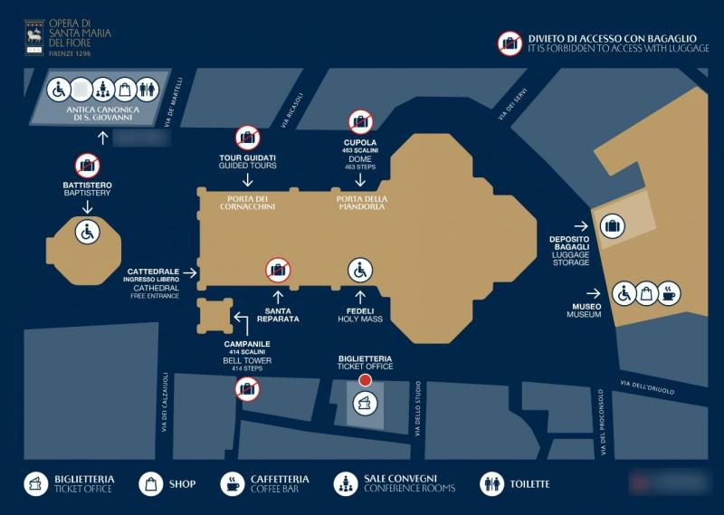

- [Italy](#italy)
  - [2024/12/22 米兰 Milan Italy](#20241222-米兰-milan-italy)
  - [2024/12/23 米兰，佛罗伦萨 Milan, Firenze Italy](#20241223-米兰佛罗伦萨-milan-firenze-italy)
  - [2024/12/24 佛罗伦萨 Firenze, Milan Italy](#20241224-佛罗伦萨-firenze-milan-italy)
- [Norway](#norway)
  - [2024/12/25 特罗姆瑟 Tromso Norway](#20241225-特罗姆瑟-tromso-norway)
  - [2024/12/26 特罗姆瑟 Tromso Norway](#20241226-特罗姆瑟-tromso-norway)
  - [2024/12/27 特罗姆瑟 Tromso, Bergen Norway](#20241227-特罗姆瑟-tromso-bergen-norway)
  - [2024/12/28 卑尔根 Bergen Norway](#20241228-卑尔根-bergen-norway)
  - [2024/12/29 卑尔根 Bergen Norway](#20241229-卑尔根-bergen-norway)
- [Iceland](#iceland)
  - [2024/12/30 雷克雅未克 Reykjavik Iceland](#20241230-雷克雅未克-reykjavik-iceland)
  - [2024/12/31 雷克雅未克 Reykjavik Iceland](#20241231-雷克雅未克-reykjavik-iceland)
  - [2025/1/1 雷克雅未克 Reykjavik Iceland](#202511-雷克雅未克-reykjavik-iceland)
  - [2025/1/2 冰岛南部 Reykjavik Iceland](#202512-冰岛南部-reykjavik-iceland)
  - [2025/1/3 冰岛南部 Reykjavik, Iceland](#202513-冰岛南部-reykjavik-iceland)
  - [2025/1/4 冰岛南部 Reykjavik, Iceland](#202514-冰岛南部-reykjavik-iceland)
  - [2025/1/5 哥本哈根 飞机上 Reykjavik Iceland, Copenhagen](#202515-哥本哈根-飞机上-reykjavik-iceland-copenhagen)
- [Italy2](#italy2)
  - [2025/1/6 米兰 Milan Italy](#202516-米兰-milan-italy)
  - [2025/1/7 米兰 Milan Italy](#202517-米兰-milan-italy)
  - [2025/1/8 回家 Milan Italy](#202518-回家-milan-italy)
- [TODO](#todo)

# Italy

## 2024/12/22 米兰 Milan Italy
- 航班
  - 10:45 羽田(T3) LH715 → MUNICH(T2) 17:10
  - 18:15 MUNICH(T2) LH1858 → MILAN(MXP T1) 19:20
- 酒店
  - Moxy Milan Malpensa Airport (T2)
- Shuttle Bus
  - Terminal 1: the shuttle bus stop is located in front of the Sheraton Hotel.
  - Terminal 2: the shuttle stop for T1 is located near the Train Station.
  - <https://www.milanomalpensa-airport.com/en/from-to/connections-with-terminals>
- 寄存
  - Left Luggage: Located next to Exit 5 in Terminal 1's Arrival Hall
  -  7 AM – 9 PM

## 2024/12/23 米兰，佛罗伦萨 Milan, Firenze Italy
- 火车
  - Airport T2 → Milan central station
    - MALPENSA EXPRESS <https://www.malpensaexpress.it/>
  - Milan central station → Firenze santa maria novella
    - **TODO** ITALO 10:40 - 12:35 65EUR
- 景点/计划
  - **[√]圣母百花大教堂(14:15-15:00)** Cattedrale di Santa Maria del Fiore
    - Entry to Brunelleschi's Dome from Porta della Mandorla (North side of the Cathedral). 
    - Visitors are required to climb 463 step
    - 
  - 老桥，米开朗基罗广场(落日)
    - 老桥 Ponte Vecchio
    - 米开朗基罗广场 Piazzale Michelangelo (1.5km from 老桥)
- 酒店
  - Grand Hotel Baglioni
- Memo
  - bus: 30分/1回 10EUR 75分to central
    - station Autostradale 143
      - <https://autostradale.it/en-GB/bus-stop-timetable>
    - <https://www.malpensashuttle.it/en/index.html>

## 2024/12/24 佛罗伦萨 Firenze, Milan Italy

- 火车
  - Firenze santa maria novella → Milan central station
    - **TODO** ITALO 18:25 - 20:20 or 19:25 - 21:20 18EUR
- 景点/计划
  - **[√]乌菲兹美术馆（8:30-8:45）** Gallerie degli Uffizi
    - Piazzale degli Uffizi, 6, 50122 Firenze FI, イタリア
  - 领主广场，旧宫，学院美术馆（14-17）
    - 领主广场 Piazza della Signoria
    - 旧宫 Palazzo Vecchio
    - 学院美术馆 Galleria dell’Accademia di Firenze 
      - https://www.galleriaaccademiafirenze.it/en/visit/
  - 剪标店
- 酒店
  - Moxy Milan Malpensa Airport
- Memo
  - 18点回米兰机场。22点到入住酒店。

# Norway

## 2024/12/25 特罗姆瑟 Tromso Norway
- 航班
  - 8:30 Malpensa (T2) EJU3925 → Tromso/Langes 12:35
- 交通APP
  - Svipper
  - Bus: No.42 go to Kræmer, Tromsø
  - <https://svipper.no/?sprak=3>
  - 机场坐bus位置: K Parking
- 景点/计划
  - PM：北极大教堂，傍晚***缆车***上山观夜景，极光
  - 北极大教堂 Arctic Cathedral
    - <https://www.ishavskatedralen.no/en/the-arctic-cathedral/prices/>
    - August 16 – Dec 31: 13:00-17:00 (Wed. 14:00-17:00)
  - 缆车 fjellheisen  (夜间6点至凌晨2点之间 有机会看到神秘的北极光。)
    - 地址: Solliveien 12, N-9020 Tromsdalen
    - 巴士 (1 bus per Hour)
      - <https://shuttle.fjellheisen.no/>
    - 门票
      - <https://book.fjellheisen.no/en/todo>
- 酒店
  - Restaurant Smak AS付近

## 2024/12/26 特罗姆瑟 Tromso Norway
- 景点/计划
  - 最北麦当劳?
    - Address: **#TODO**
  - **二哈12:15~12:30集合 7時間**
    - 集合時刻 12:15 - 時間に遅れないように、予約時刻の15分前までに集合場所へお越しください。
    - 集合：Samuel Arnesens gate 5, 9008 Tromsø, Norway
      - Tromsø Havn Prostnesetのメインエントランスホール内
      - <https://www.google.com/maps/dir//69.64723,18.959833/@69.6471523,18.7950324,11z?entry=ttu&g_ep=EgoyMDI0MTExMy4xIKXMDSoASAFQAw%3D%3D>
- 酒店
  - Alfons veg 30，9010 Tromso

## 2024/12/27 特罗姆瑟 Tromso, Bergen Norway
- 航班
  - 20:00 TOS WF629 → BGO 22:05
- 景点/计划
  - **观鲸8:15~ 8時間**
    - 集合時刻 8:15 - 時間に遅れないように、予約時刻の15分前までに集合場所へお越しください。
    - 集合: Strandgata 5, 9008 Tromsø, Norway
      - トロムソの市内中心部にあるネルストランダ ショッピング センターの裏手にある港にある双胴船 MS リゲルドロンニンゲンに向かいます。
      - <https://www.google.com/maps?daddr=69.64571,18.952862>
- 酒店
  - Comfort Hotel Bergen Airport

## 2024/12/28 卑尔根 Bergen Norway
- 去市区
  - VY
- 景点/计划
  - 布吕根码头，floyen山观景台缆车 city walk
  - 布吕根码头 Bryggen
    - Bryggen, 5003 Bergen, ノルウェー
  - floyen山观景台缆车 Fløibanen - Funicular Railway
    - Vetrlidsallmenningen 23A, 5014 Bergen, ノルウェー
    - <https://floyen.no/en>
  - 
- 酒店
  - Magic Hotel & Apartments Kløverhuset

## 2024/12/29 卑尔根 Bergen Norway
- 景点/计划
  - 峡湾 （挪威缩影）
  - Fjord cruise from Bergen through Mostraumen - Rødne Fjord Cruise (rodne.no)
    - <https://rodne.no/en/fjord-experiences/bergen/fjordcruise-mostraumen/>
    - Shetlands-larsens Brygge 5014, 5014 Bergen, Norge
    - 10:00 - 13:30 （20分钟前集合
- 酒店
  - Magic Hotel & Apartments Kløverhuset

# Iceland

## 2024/12/30 雷克雅未克 Reykjavik Iceland
- 去机场巴士
  - **只有这一班 下一班8:05**
  - 06:05 Bergen Busstasjon → 06:30 Bergen lufthavn Flesland (25min)
  - https://flybussen.no/en/trip
  - VY也可以47NOK 5:44首班车 45min
- 航班
  - 8:30 Bergen Airport,Flesland SK248 → Oslo 09:25
  - 12:20 Oslo Airport SK4787 → KEF Reykjavik Airport 14:20
- 机场去市区巴士
  - flybus 30刀 45min+
- 景点/计划
- 酒店
  - Downtown Guesthouse Reykjavik

## 2024/12/31 雷克雅未克 Reykjavik Iceland
- 景点/计划
- 酒店
  - Downtown Guesthouse Reykjavik

## 2025/1/1 雷克雅未克 Reykjavik Iceland
- 景点/计划
- 酒店
  - 酒店 Frón

## 2025/1/2 冰岛南部 Reykjavik Iceland
- 景点/计划
  - **冰岛团8:30~9:00集合**
    - <https://www.tripadvisor.jp/AttractionProductReview-g189970-d12924614-3_Day_Golden_Circle_Ice_Cave_Glacier_Lagoon_Waterfalls_Tour-Reykjavik_Capital_Regi.html>
    - 只能带背包，箱子需寄存。
      - <https://www.luggagelockers.is/locations.html>
    - Pickup
      - At Bus station 6
        - https://www.google.com/maps/dir//64.1474564,-21.9329687
      - <https://nicetravel.is/bus-stops/>
    - Contact
      - 連絡先情報 Nicetravel ehf +3544190100

## 2025/1/3 冰岛南部 Reykjavik, Iceland
## 2025/1/4 冰岛南部 Reykjavik, Iceland
- 酒店
  - 酒店 Reykjavik Centrum

## 2025/1/5 哥本哈根 飞机上 Reykjavik Iceland, Copenhagen 
- 航班
  - 11:50 Reykjavik KEF SK4788 → Oslo Gardermoen 15:30
  - 16:10 Oslo Gardermoen SK 459 - Copenhagen Kastrup 17:25
- 酒店
  - Clarion Hotel Copenhagen Airport

# Italy2
## 2025/1/6 米兰 Milan Italy
- 航班
  - 10:20 CPH-KASTRUP AIRPORT (T2) U23924 → MXP-MALPENSA AIRPORT (T2) 12:35
- 酒店
  - Moxy Milan Malpensa Airport
  
## 2025/1/7 米兰 Milan Italy
- 景点/计划
  - **圣家堂?**
- 酒店
  - Moxy Milan Malpensa Airport

## 2025/1/8 回家 Milan Italy
- 航班
  - 09:50 MILAN(MXP T1) LX1613 → ZURICH 10:55
  - 13:05 ZURICH LX160 → NARITA(T1) 1/9 10:10

---
[酒店詳細](./hotel_list.md)  
[航班詳細](./flight_list.md)  

# TODO
- 12/30
  - 06:05 Bergen Busstasjon → 06:30 Bergen lufthavn Flesland (25min)
  - https://flybussen.no/en/trip
- ITALO
  - [ ] Milan central station → Firenze santa maria novella 10:40 - 12:35
  - [ ] Firenze santa maria novella → Milan central station 18:25 - 20:20 or 19:25 - 21:20
- [ ] 卑尔根 峡湾
- [ ] 圣家堂?