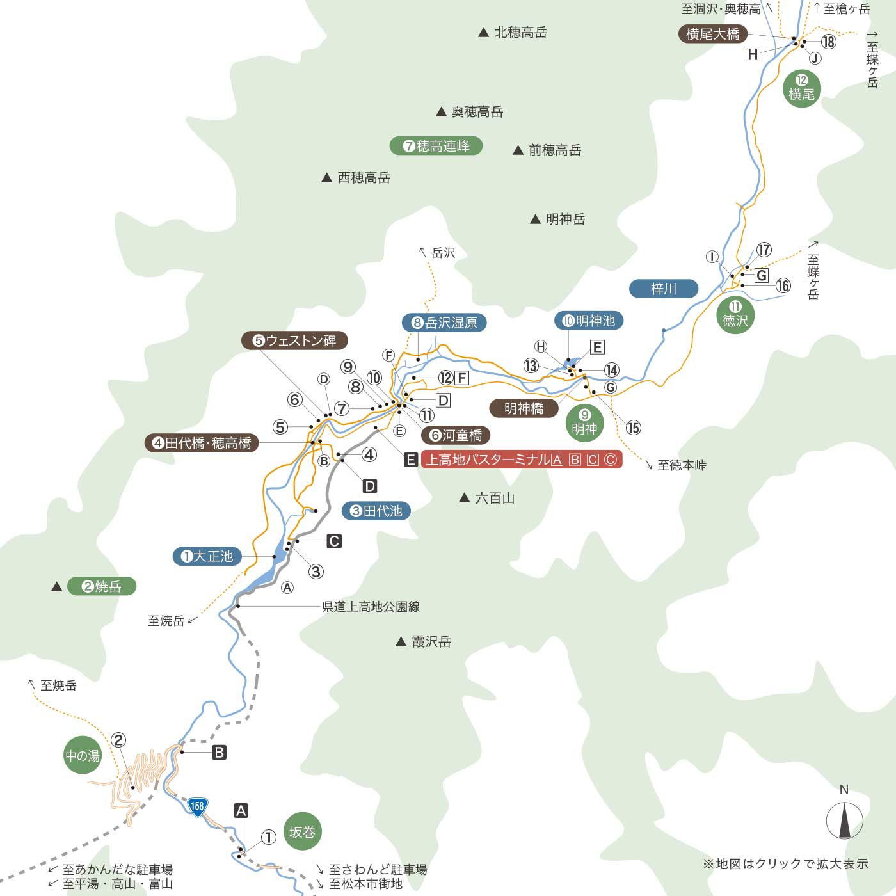
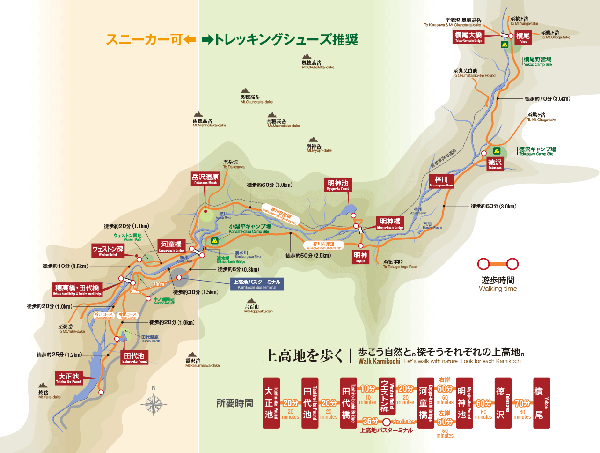
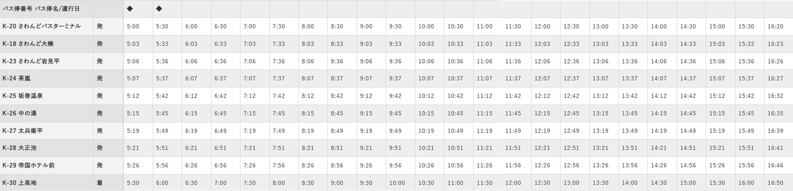
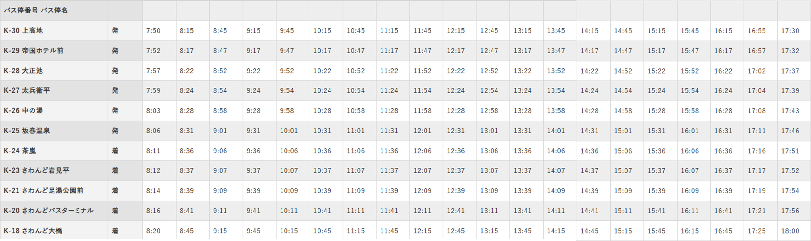
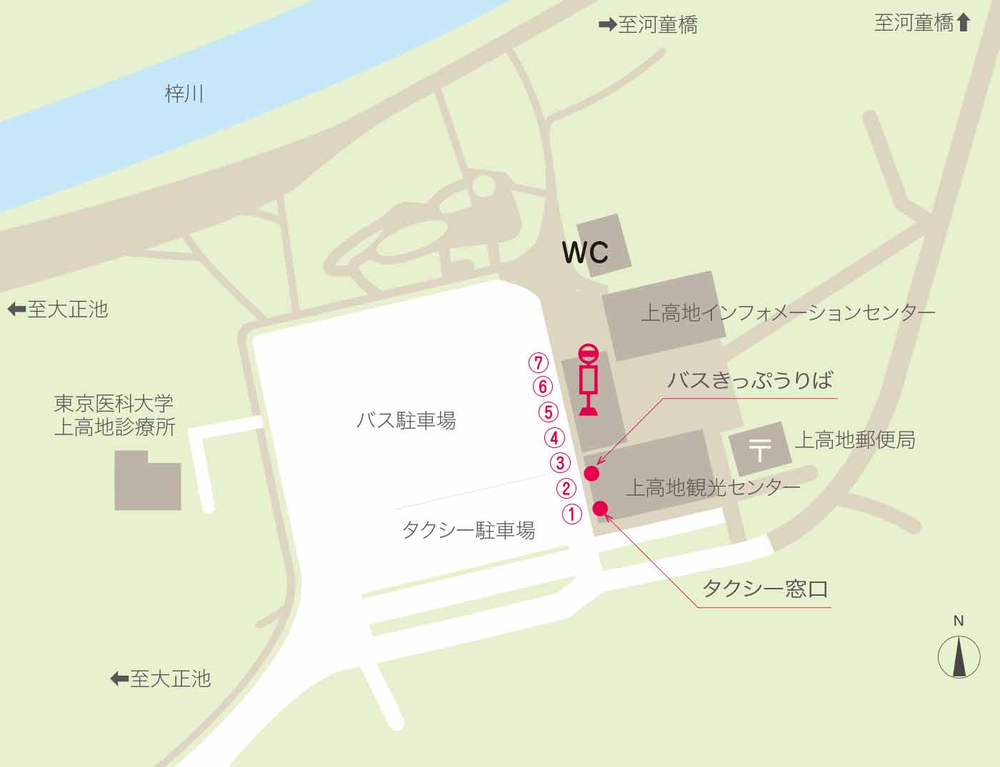

# 路线
  - https://www.kamikochi.or.jp/enjoy/walking/
  - 园内地图
    - 
  - 路线图
    - 
  - ウォーキングコースのご案内
    - 1時間コース
      - ●バスターミナル→河童橋→梓川右岸→ウエストン碑→田代橋→梓川左岸→バスターミナル
    - 2時間コース
      - ●バスターミナル→河童橋→梓川左岸→明神池→梓川右岸→河童橋→バスターミナル
    - 3時間コース
      - ●バスターミナル→河童橋→明神分岐→明神池→河童橋→ウエストンレリーフ→田代橋・穂高橋→中の瀬園地→バスターミナル
    - 4時間コース
      - ●バスターミナル→河童橋→ビジターセンター→明神橋→明神池→河童橋→ウエストン碑→田代橋→自然研究路→大正池往復→バスターミナル
    - 5時間コース
      - ●バスターミナル→河童橋→明神→徳沢→新村橋→徳沢→明神橋→明神池→河童橋→ウエストン碑→田代橋→バスターミナル    
  - 大正池⇄上高地バスターミナル
    - ■ 大正池⇄梓川左岸／徒歩約25分（約1.2km）⇄田代池・田代湿原⇄徒歩約20分（約1.0km）⇄田代橋・穂高橋⇄梓川右岸コース／徒歩約10分（約0.5km）⇄ウェストン碑→徒歩約20分（約1.1km）⇄河童橋⇄徒歩約6分（約0.3km）⇄上高地バスターミナル
    - ■ 大正池⇄梓川左岸／徒歩約25分（約1.2km）⇄田代池・田代湿原⇄徒歩約20分（約1.0km）⇄田代橋・穂高橋⇄梓川左岸コース／徒歩約30分（約1.5km）⇄上高地バスターミナル
  - 河童橋⇄大正池（梓川右岸コース）徒歩約75分（約3.8km）
    - ●河童橋⇄徒歩約20分（約1.1km）⇄ウェストン碑
    - ●ウェストン碑⇄徒歩約10分（約0.5km）⇄田代橋・穂高橋
    - ●田代橋・穂高橋⇄徒歩約20分（約1.0km）⇄田代池［梓川コース／林間コース］
    - ●田代池⇄徒歩約25分（約1.2km）⇄大正池

# 沢渡（さわんど）駐車場周辺案内
  - https://www.kamikochi.or.jp/access/sawando/
  - 詳細(https://www.alpico.co.jp/traffic/local/kamikochi/sawando/)
  - さわんど駐車場⇒上高地 时刻表
    - 
  - 上高地⇒さわんど駐車場 时刻表
    - 
  - お車は、市営第三駐車場（かすみ沢駐車場）にお停めください。
満車の場合は、市営第二駐車場（足湯公園駐車場）をご利用ください。

# のりば案内
  - さわんどバスターミナル
    - のりば 1 さわんど駐車場～上高地
    - 〇14
      - 
  - 上高地
    - のりば 7 さわんど駐車場～上高地
    - バス乗降場所
    - https://www.kamikochi.or.jp/access/terminal/
    - 